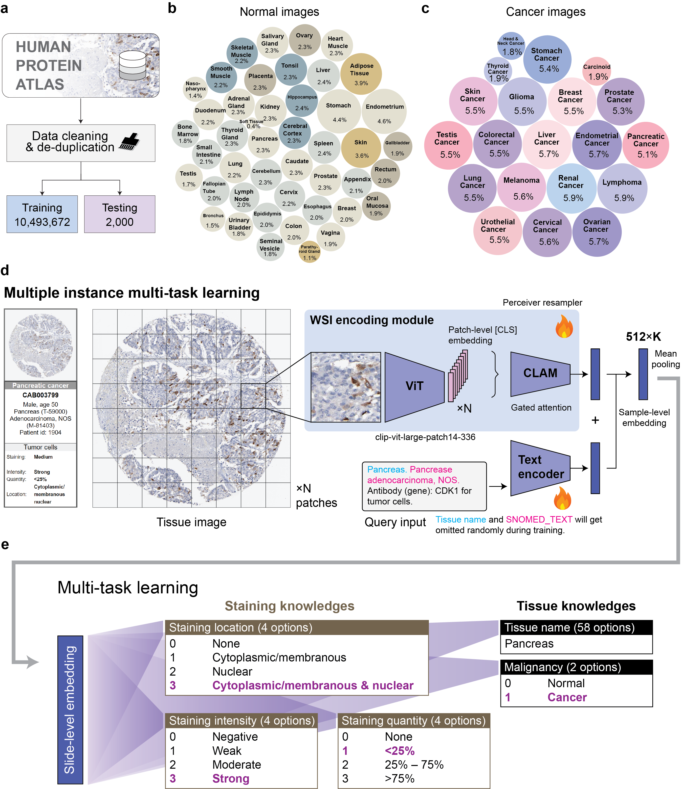

# iSight: Towards expert-AI co-assessment for improved immunohistochemistry staining interpretation
[](https://arxiv.org/abs/2602.04063)  

A deep learning-based multi-task prediction system for automated analysis of immunohistochemistry (IHC) pathology images and protein staining patterns.

## 📊 System Overview



**Figure 1: Overview of the HPA10M dataset composition and iSight's multi-task architecture for automated IHC assessment.**

**a**, Workflow illustrating how the dataset is curated from the Human Protein Atlas repository.  
**b**, Composition showing 45 distinct normal tissue types included in the HPA10M dataset.  
**c**, Breakdown of 20 primary cancer types represented in HPA10M.  
**d**, Architecture overview: whole slide images are first partitioned into 336×336 pixel patches, then encoded using CLIP-ViT-large-patch-14-336. Features from all patches are aggregated through CLAM's gated attention mechanism. In parallel, clinical metadata (tissue type, SNOMED codes, antibody details) is processed via CLIP's text encoder.  
**e**, Multi-task prediction framework: five independent classification heads process the aggregated features to predict staining characteristics (subcellular location, intensity level, positive cell percentage) and specimen properties (tissue category, malignancy).

*Source: Human Protein Atlas database ([v23.proteinatlas.org](http://v23.proteinatlas.org/ENSG00000170312-CDK1/))*

## 🔗 Links

| Resource | Link |
|----------|------|
| **Dataset** | [nirschl-lab/hpa10m](https://huggingface.co/datasets/nirschl-lab/hpa10m) |
| **Model Checkpoint** | [nirschl-lab/iSight](https://huggingface.co/nirschl-lab/iSight) |


**Validation Dataset Location**: `validation_data/` directory also contains representative samples with corresponding metadata and segmentation masks.

## 🎯 Core Features

The system simultaneously predicts 5 key attributes of IHC images:

1. **Staining Intensity**: 4 classes
   - negative
   - weak
   - moderate
   - strong

2. **Staining Location**: 4 classes
   - none
   - cytoplasmic/membranous
   - nuclear
   - cytoplasmic/membranous,nuclear

3. **Staining Quantity**: 4 classes
   - none
   - <25%
   - 25%-75%
   - \>75%

4. **Tissue Type**: 58 classes
   - Various human tissue types (liver, lung, kidney, breast, etc.)

5. **Malignancy**: 2 classes
   - normal
   - cancer


### Environment Setup

**Typical install time**: ~5–10 minutes on a normal desktop computer (depending on network speed for downloading PyTorch and model weights).

```bash
# 1. Create a new conda environment with Python 3.10
conda create -n ihc python=3.10 -y
conda activate ihc

# 2. Install PyTorch with CUDA support
#    Check your CUDA version first: nvidia-smi
#    For versions, see: https://pytorch.org/get-started/previous-versions/
# pip install torch==2.1.0 torchvision==0.16.0 --index-url https://download.pytorch.org/whl/cu121

# 3. Install remaining dependencies
pip install -r requirements.txt
```

### Running Inference

```bash

# Modify the following paths:
# - CONFIG_FILE: Path to config file
# - CHECKPOINT_PATH: Path to model weights
# - INFERENCE_DATA: Input data CSV
# - HDF5_BASE_DIR: RLE mask directory
# - OUTPUT_DIR: Output directory

# Run inference
bash inference_script.sh
```

### Expected Output

**Expected run time**: On a normal desktop computer with a standard GPU, each image can be processed **within a few seconds**.

After running inference, the following files will be generated in the output directory (`results/`):

| File | Description |
|------|-------------|
| `inference_results_<save_name>.csv` | Per-sample predictions with ground truth labels, predicted labels, and logits for all 5 tasks |
| `metrics_<save_name>.csv` | Evaluation metrics (accuracy, balanced accuracy, weighted F1) for each task |
| `metrics_<save_name>.json` | Same metrics in JSON format |
| `inference_config.json` | Configuration used for this inference run |
| `visualizations/<save_name>/` | Confusion matrix plots (counts and normalized) for each task (when `--generate_visualizations` is enabled) |

## 📧 Contact

For questions or suggestions, please contact: [zhi.huang@pennmedicine.upenn.edu)]

