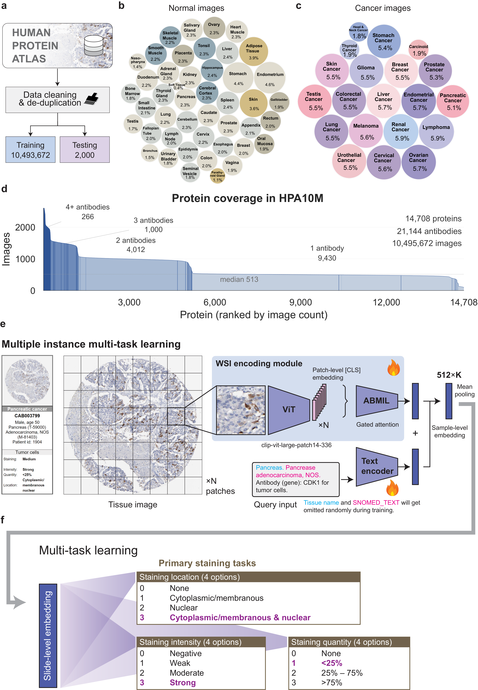

# iSight: Towards expert-AI co-assessment for improved immunohistochemistry staining interpretation
[](https://arxiv.org/abs/2602.04063)

A deep learning-based multi-task prediction system for automated analysis of immunohistochemistry (IHC) pathology images and protein staining patterns.

## 📊 System overview



**Figure 1: Overview of the HPA10M dataset composition and iSight's multi-task architecture for automated IHC assessment.**

**a**, Dataset construction workflow from the Human Protein Atlas.
**b**, Distribution of 45 normal tissue types in HPA10M.
**c**, Distribution of 20 major cancer types in HPA10M.
**d**, Protein coverage of HPA10M. Each bar is one of the 14,708 protein targets, ranked by image count; shading gives the number of antibodies for that protein (9,430 targets have one antibody, 4,012 have two, 1,000 have three and 266 have four or more). The median target has 513 images. For machine learning purposes the dataset is randomly split into a training set of 10,493,672 images and a held-out test set of 2,000 images.
**e**, The model processes images by dividing them into 336×336 patches, extracting visual features with a Vision Transformer (CLIP-ViT-large-patch-14-336), and aggregating patch-level representations using gated attention-based multiple instance learning (MIL). Text metadata, including tissue type, SNOMED diagnosis and antibody information, is encoded separately using the CLIP text encoder.
**f**, The multi-task learning framework simultaneously predicts staining location, intensity and quantity.

*Source: Human Protein Atlas database ([v23.proteinatlas.org](http://v23.proteinatlas.org/ENSG00000170312-CDK1/))*

## 🧩 Two complementary models

iSight reads an IHC image at two levels.

- **iSight-slide** looks at the whole image and returns one assessment per image: staining
  location, intensity and stained fraction. It needs no cell segmentation and covers every
  marker in the training corpus.
- **iSight-cell** works cell by cell: nuclei are segmented, **iSight-target** picks out the
  cells of interest for that tissue (tumour cells in a carcinoma, hepatocytes in liver, and
  so on), and iSight-cell then scores each of them for staining intensity and location. The
  image-level result is built up from the cells, so it comes with a cell count, a spatial map
  and a stained fraction that is measured rather than estimated. iSight-cell requires
  iSight-target.

## 🔗 Links

| Resource | Link |
|----------|------|
| **Training dataset** | [nirschl-lab/hpa10m](https://huggingface.co/datasets/nirschl-lab/hpa10m) |
| **iSight-slide** checkpoint | [zhihuanglab/iSight-slide](https://huggingface.co/zhihuanglab/iSight-slide) |
| **iSight-cell** checkpoint | [zhihuanglab/iSight-cell](https://huggingface.co/zhihuanglab/iSight-cell) |
| **iSight-target** checkpoint | [zhihuanglab/iSight-target](https://huggingface.co/zhihuanglab/iSight-target) |

## 🚀 Setup

**Typical install time**: ~5–10 minutes (depending on network speed for PyTorch and model weights).

```bash
conda create -n isight python=3.10 -y && conda activate isight
# PyTorch with CUDA, matching your driver (nvidia-smi); versions at pytorch.org/get-started/previous-versions
# pip install torch==2.1.0 torchvision==0.16.0 --index-url https://download.pytorch.org/whl/cu121
pip install -r requirements.txt
```

Checkpoints:

```python
from huggingface_hub import hf_hub_download
slide  = hf_hub_download("zhihuanglab/iSight-slide",  "checkpoints/iSight-slide.pth")
cell   = hf_hub_download("zhihuanglab/iSight-cell",   "checkpoints/iSight-cell.pt")
target = hf_hub_download("zhihuanglab/iSight-target", "checkpoints/iSight-target.pt")
```

---

## 🔬 iSight-slide

CLIP ViT-L/14-336 patch encoder over all 336 px tissue patches of an image. Every patch
contributes all 576 of its ViT tokens; a gated attention module scores each token position and
softmaxes **across patches** at that position, so pooling is per token rather than per patch.
The pooled representation is the mean over tokens. Two conditioning signals are added to it: a
text (context) branch encoding the query (tissue, diagnosis and gene), applied with dropout
during training, and a cell-type embedding. Linear heads predict the three staining tasks:

| Task | Classes | Labels |
|------|---------|--------|
| **Staining location** | 4 | none, cytoplasmic/membranous, nuclear, cytoplasmic/membranous,nuclear |
| **Staining intensity** | 4 | negative, weak, moderate, strong |
| **Staining quantity** | 4 | none, <25%, 25%-75%, >75% |

The released checkpoint also carries two auxiliary heads used as additional supervision while
training — tissue type (58 classes) and malignancy (2 classes). `scripts/inference.py` reports
them alongside the three staining tasks.

```
isight_slide/
  model/patch_encoder_with_clam.py   encoder, all-token gated attention, conditioning, heads
  dataset/hpadataset.py              HPA10M MIL dataset, tissue-mask patching
  train.py                           training (DDP, resumable)
  config/config.ini                  the released configuration (batch_size 1, lr 1e-6, 10 epochs)
  scripts/inference.py               image-level inference
```

**Inference** on the validation set:

```bash
CHECKPOINT_PATH=/path/to/iSight-slide.pth bash inference_script.sh
```

**Expected run time**: on a standard GPU each image is processed within a few seconds.
Outputs in `results/`:

| File | Description |
|------|-------------|
| `inference_results_<save_name>.csv` | Per-sample predictions with ground truth, predicted labels and logits for all 5 tasks |
| `metrics_<save_name>.csv` / `.json` | Accuracy, balanced accuracy and weighted F1 per task |
| `inference_config.json` | Configuration used for the run |
| `visualizations/<save_name>/` | Confusion matrices per task (with `--generate_visualizations`) |

**Training**:

```bash
export ISIGHT_DATA_ROOT=/path/to/hpa10m          # metadata, RLE masks, images
cd isight_slide && python train.py --config config/config.ini
```

| variable | what |
|---|---|
| `ISIGHT_DATA_ROOT` | root for the defaults below |
| `ISIGHT_TRAIN_META` / `ISIGHT_TEST_META` | HPA10M split metadata (feather) |
| `ISIGHT_RLE_DIR` / `ISIGHT_RLE_INDEX` | RLE tissue masks and their index |
| `ISIGHT_IMAGE_DIR` | images, only for the `simple_downsample` version |
| `SCHEDULER_PER_EPOCH=1` | step the LR scheduler per epoch instead of per batch |

---

## 🧫 iSight-cell (with iSight-target)

Nuclei are segmented first (Cellpose-SAM or StarDist). **iSight-target**, a UNI2-h backbone
with one binary head per class in `isight_cell/meta/classes_43.csv` (43 tissue × cell-type classes), selects
the cells of interest for the image's class. **iSight-cell**, a UNI2-h backbone fully
fine-tuned with two heads, then predicts staining intensity (4) and subcellular location (4)
for each selected cell.

```
isight_cell/code/
  target_cell/extract_target_crops.py  crops for the 43 target classes
  target_cell/train_target_head.py     iSight-target: 43 binary heads on UNI2-h
  pipeline/                            iSight-cell: training, self-refinement, prediction, evaluation
  pipeline/earlystop.py                early stopping
  deps/                                model class and UNI2-h backbone
  tissue.py                            tissue mask
isight_cell/meta/classes_43.csv        the 43 target classes; the single definition of the
                                       class space, used by extraction, training and selection
```

**Pipeline, in run order**

| # | script | what it does |
|---|---|---|
| 1 | `pipeline/tissue_mask_gen.py` | tissue mask per image |
| 2 | `target_cell/extract_target_crops.py` | 64×64 crops for the 43 target classes |
| 3 | `target_cell/train_target_head.py` | trains iSight-target |
| 4 | `pipeline/select_target_v2.py` | applies iSight-target per image, keeps the target cells |
| 5 | `pipeline/train_foundation.py` | iSight-cell, step 1: image labels broadcast onto cells |
| 6 | `pipeline/predict_all_target.py` | scores every cell with the step-1 model |
| 7 | `pipeline/refine_target.py` | keeps cells whose prediction agrees with the image label on both heads |
| 8 | `pipeline/scan_refined.py` | per-cell index over the refined pool (`$SCAN_NPZ` for step 2) |
| 9 | `pipeline/train_shards_resample.py` | iSight-cell, step 2: balanced resampling over the refined cells |

Evaluation: `pipeline/val_richeval.py` (validation, image-level accuracy and QWK),
`pipeline/eval_test500k_fixedloc.py` (held-out 500K set), `pipeline/eval_flats_fixed.py`
(any image list, same aggregation), `pipeline/agg_uncap.py` (image-level metrics with no
per-image cell cap).

| variable | what |
|---|---|
| `ISIGHT_ROOT` | project root for the iSight-cell scripts |
| `UNI2_CKPT_PATH` | UNI2-h weights ([MahmoodLab/UNI2-h](https://huggingface.co/MahmoodLab/UNI2-h)) |
| `CKPT` | iSight-target checkpoint for `select_target_v2.py`; iSight-cell checkpoint for `predict_all_target.py` |
| `EARLY_STOP` / `ES_METRIC` / `ES_MIN_DELTA` / `ES_PATIENCE` | early stopping (on by default) |

---

## 🗂 Validation data

`validation_data/` holds the 2,000-image validation set: images, RLE tissue masks
(`rle_masks/validation_masks.h5` + `rle_mask_index.json`) and `validation_metadata.csv`.
The files are stored with Git LFS; install [git-lfs](https://git-lfs.com) before cloning, or run
`git lfs pull` in an existing clone.

## 📄 License

See [LICENSE](LICENSE) (PENN Academic Software License Agreement).

## 📧 Contact

Zhi Huang — [zhi.huang@pennmedicine.upenn.edu](mailto:zhi.huang@pennmedicine.upenn.edu)
